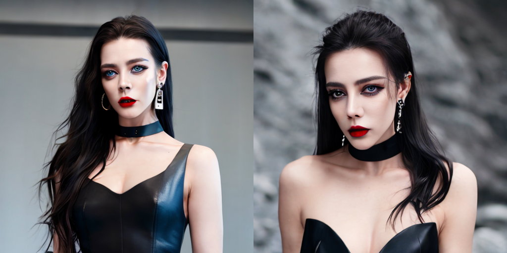
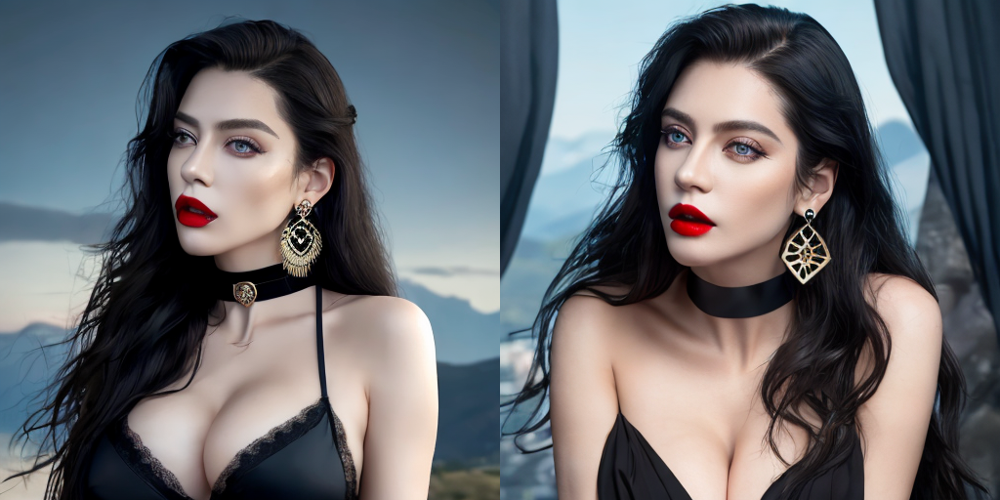
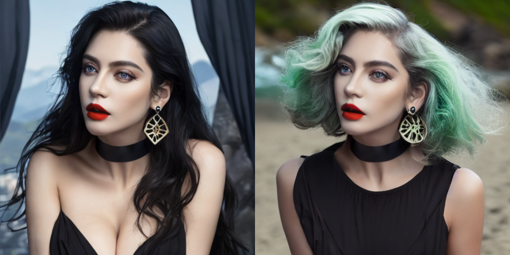
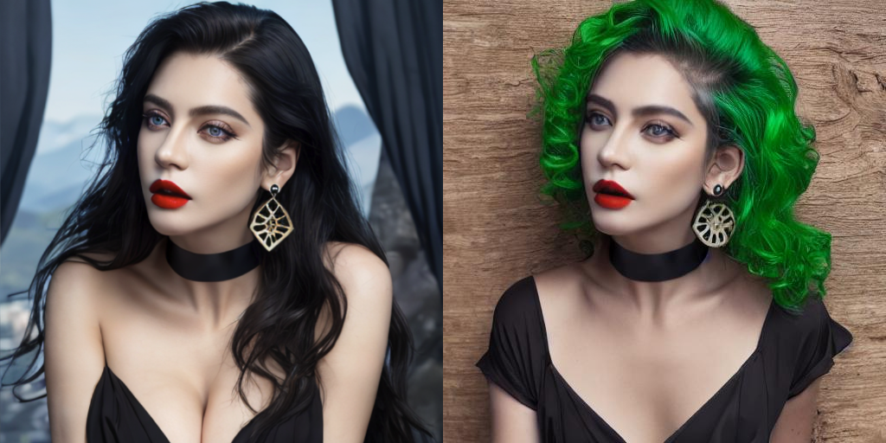
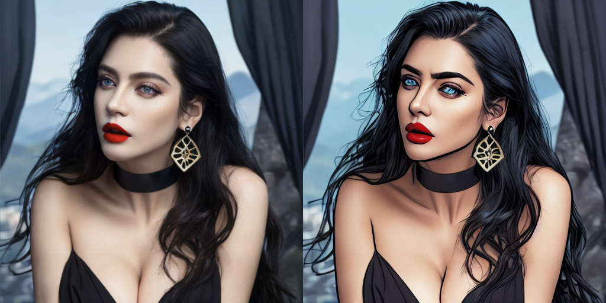

# Simple-Lora
这是一个区别于[automatic1111 webui](https://github.com/AUTOMATIC1111/stable-diffusion-webui),对开发者更友好的lora训练，或者说虚拟idol训练
## 好消息
* google colab端可操作: [](https://colab.research.google.com/github/LeslieZhoa/Simple-Lora/blob/main/demo.ipynb)
## 展示
展示一下我用少量迪丽热巴照片训练的lora效果，一个欧美混血热巴

## 环境
```
pip install -r requirements.txt
git lfs install
```
## 预训练模型
```py
# blip 模型
wget https://storage.googleapis.com/sfr-vision-language-research/BLIP/models/model_base_caption_capfilt_large.pth -P ./pretrained_models

# bert-base-uncased
cd pretrained_models
git clone https://huggingface.co/bert-base-uncased

# diffusion base model
# 我选用的是chilloutmix_NiPrunedFp32Fix
git clone https://huggingface.co/naonovn/chilloutmix_NiPrunedFp32Fix
# safetenosor模型转换
cd ..
python process/convert_original_stable_diffusion_to_difdusers.py \
    --checkpoint_path ./pretrained_models/chilloutmix_NiPrunedFp32Fix/chilloutmix_NiPrunedFp32Fix.safetensors \
    --dump_path ./pretrained_models/chilloutmixNiPruned_Tw1O --from_safetensors
```
## 数据准备
1. huggingface数据[option]<br>
[pokemon](https://huggingface.co/datasets/lambdalabs/pokemon-blip-captions/tree/main)数据为例
```
# 下载数据
mkdir -p dataset
cd dataset
git clone https://huggingface.co/datasets/lambdalabs/pokemon-blip-captions/
```
2. 用户数据[option]<br>
单张图片的lora训练<br>
```py
# 图片文本获取
python process/run_caption.py --img_base ./dataset/custom

# 将a woman 替换成<dlrb>
python process/change_txt.py --img_base ./dataset/custom --ori_txt 'a woman' --new_txt "<dlrb>"
```
## 训练
参数调整[self.custom = True](./model/config.py#L5)为True使用用户数据，False使用huggingfaec数据<br>
```py
--train_text_encoder # 开启text_encoder lora训练
--dist # 关闭DDP多机多卡训练模式
--batch_size 1 # 设置batch_size大小

# 训练脚本
python  train.py  --batch_size 1 --dist --train_text_encoder 
```
## 推理
```py
python inference.py \
    --mode 'lora' \
    --lora_path checkpoint/Lora/000-00000600.pth \
    --prompt  "<dlrb>,solo, long hair, black hair, choker, breasts, earrings, blue eyes, jewelry, lipstick, makeup, dark, bare shoulders, mountain, night, upper body, dress, large breasts, ((masterpiece))" \
    --outpath results/1.png \
    --num_images_per_prompt 2 
```
越少的训练图片，选取的模型迭代次数应该越小，比如单张图训练选1000左右，10张图训练选2500左右

## controlnet
新增controlnet转换，参考[Here](https://github.com/lllyasviel/ControlNet/discussions/12)<br>
1. 下载原始模型[v1-5-pruned.ckpt](https://huggingface.co/runwayml/stable-diffusion-v1-5/blob/main/v1-5-pruned.ckpt),[control_sd15_openpose.pth](https://huggingface.co/lllyasviel/ControlNet/blob/main/models/control_sd15_openpose.pth)到pretrained_models中
2. 将自有基础模型转换成controlnet形式<br>
```
python process/tool_transfer_control.py \
--path_input pretrained_models/chilloutmix_NiPrunedFp32Fix/chilloutmix_NiPrunedFp32Fix.safetensors \
--path_output pretrained_models/chilloutmix_control.pth
```
3. controlnet转成diffuser形式
```py
python process/convert_controlnet_to_diffusers.py \
--checkpoint_path  pretrained_models/chilloutmix_control.pth \
--original_config_file model/third/cldm_v15.yaml \
--dump_path  pretrained_models/chilloutmix_control --device cuda
```
4. 下载openpose模型[body_pose_model.pth](https://huggingface.co/lllyasviel/ControlNet/resolve/main/annotator/ckpts/body_pose_model.pth),[hand_pose_model.pth](https://huggingface.co/lllyasviel/ControlNet/resolve/main/annotator/ckpts/hand_pose_model.pth)到pretrained_models/openpose下
5. 推理
```py
python inference.py \
    --mode 'control' \
    --lora_path checkpoint/Lora/000-00000600.pth \
    --control_path pretrained_models/chilloutmix_control \
    --pose_img assets/pose.png \
    --prompt  "<dlrb>,solo, long hair, black hair, choker, breasts, earrings, blue eyes, jewelry, lipstick, makeup, dark, bare shoulders, mountain, night, upper body, dress, large breasts, ((masterpiece))" \
    --outpath results/1.png \
    --num_images_per_prompt 2
```

## Inpaiting
1. 下载模型
```py
cd pretrained_models
git clone https://huggingface.co/runwayml/stable-diffusion-inpainting
# 下载parsing模型
wget https://github.com/LeslieZhoa/LVT/releases/download/v0.0/face_parsing.pt -P pretrained_models
```
2. 推理
```py
python inference.py \
    --mode 'inpait' \
    --inpait_path pretrained_models/stable-diffusion-inpainting \
    --mask_area all \
    --ref_img assets/ref.png \
    --prompt  "green hair,short hair,curly hair, green hair,beach,seaside" \
    --outpath results/1.png \
    --num_images_per_prompt 2
```

## T2I-Adapter
inpaiting更加丝滑<br>
1. 下载adapter模型<br>
```py
wget https://huggingface.co/TencentARC/T2I-Adapter/resolve/main/models/t2iadapter_seg_sd14v1.pth -P pretrained_models
```
2. 推理
```py
python inference.py \
    --mode 't2iinpait' \
    --ref_img assets/t2i-input.png \
    --mask assets/t2i-mask.png \
    --adapter_mask assets/t2i-adapter.png \
    --prompt  "green hair,curly hair, green hair,beach,seaside" \
    --outpath results/1.png \
    --num_images_per_prompt 2
```

## Insruct-Pix2Pix风格化
1. 模型下载
```py
cd pretrained_models
git clone https://huggingface.co/timbrooks/instruct-pix2pix
```
2. 推理
```py
python inference.py \
    --mode 'instruct' \
    --ref_img assets/t2i-input.png \
    --prompt  "turn her face to comic style" \
    --neg_prompt None \
    --image_guidance_scale 1 \
    --outpath results/1.png \
    --num_images_per_prompt 1
```

## 静态照片动起来
模型主要来源于https://github.com/zhanglonghao1992/One-Shot_Free-View_Neural_Talking_Head_Synthesis,增加了512高清清晰度
```
wget https://github.com/LeslieZhoa/Simple-Lora/releases/download/v0.0/script.zip
unzip script.zip && rm -rf script.zip 
python script/run.py  --input assets/6.png
ffmpeg  -r 25 -f image2 -i results/%06d.png  -vcodec libx264   11.mp4
```
[](./assets/11.mp4)
## 参考
https://github.com/huggingface/diffusers<br>
https://github.com/AUTOMATIC1111/stable-diffusion-webui<br>
https://github.com/salesforce/BLIP<br>
https://github.com/haofanwang/Lora-for-Diffusers<br>
https://github.com/lllyasviel/ControlNet<br>
https://github.com/haofanwang/ControlNet-for-Diffusers<br>
https://github.com/haofanwang/T2I-Adapter-for-Diffusers<br>
https://github.com/TencentARC/T2I-Adapter<br>
https://github.com/HimariO/diffusers-t2i-adapter<br>
https://github.com/zhanglonghao1992/One-Shot_Free-View_Neural_Talking_Head_Synthesis

## Star History

[](https://star-history.com/#LeslieZhoa/Simple-Lora&Date)
