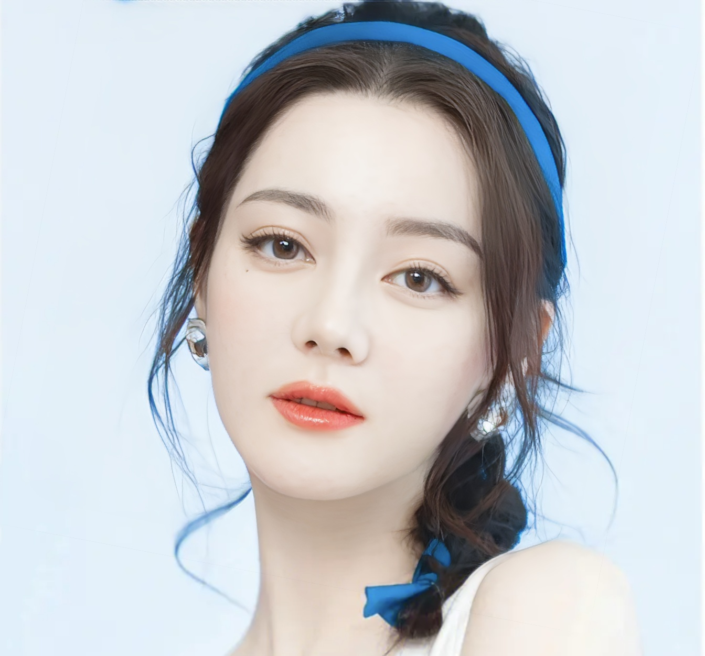

# Simple-Lora
这是一个区别于[automatic1111 webui](https://github.com/AUTOMATIC1111/stable-diffusion-webui),对开发者更友好的lora训练，或者说虚拟idol训练
## 展示
展示一下我用少量迪丽热巴照片训练的lora效果，一个欧美混血热巴

## 环境
```
pip install -r requirements.txt
git lfs install
```
## 预训练模型
```py
# blip 模型
wget https://storage.googleapis.com/sfr-vision-language-research/BLIP/models/model_base_caption_capfilt_large.pth -P ./pretrained_models

# bert-base-uncased
cd pretrained_models
git clone https://huggingface.co/bert-base-uncased

# diffusion base model
# 我选用的是chilloutmix_NiPrunedFp32Fix
git clone https://huggingface.co/naonovn/chilloutmix_NiPrunedFp32Fix
# safetenosor模型转换
cd ..
python process/convert_original_stable_diffusion_to_difdusers.py \
    --checkpoint_path ./pretrained_models/chilloutmix_NiPrunedFp32Fix/chilloutmix_NiPrunedFp32Fix.safetensors \
    --dump_path ./pretrained_models/chilloutmixNiPruned_Tw1O --from_safetensors
```
## 数据准备
1. huggingface数据[option]<br>
[pokemon](https://huggingface.co/datasets/lambdalabs/pokemon-blip-captions/tree/main)数据为例
```
# 下载数据
mkdir -p dataset
cd dataset
git clone https://huggingface.co/datasets/lambdalabs/pokemon-blip-captions/
```
2. 用户数据[option]<br>

以该图片为例，单张图片的lora训练<br>
```py
# 图片文本获取
python process/run_caption.py --img_base ./dataset/custom

# 将a woman 替换成<dlrb>
python process/change_txt.py --img_base ./dataset/custom --ori_txt 'a woman' --new_txt "<dlrb>"
```
## 训练
参数调整[self.custom = True](./model/config.py#L5)为True使用用户数据，False使用huggingfaec数据<br>
```py
--train_text_encoder # 开启text_encoder lora训练
--dist # 关闭DDP多机多卡训练模式
--batch_size 1 # 设置batch_size大小

# 训练脚本
python  train.py  --batch_size 1 --dist --train_text_encoder 
```
## 推理
```py
python inference.py \
    --lora_path checkpoint/Lora/001-00002600.pth \
    --prompt  "<dlrb>,solo, long hair, black hair, choker, breasts, earrings, blue eyes, jewelry, lipstick, makeup, dark, bare shoulders, mountain, night, upper body, dress, large breasts, ((masterpiece))" \
    --outpath results/1.png \
    --num_images_per_prompt 2
```
越少的训练图片，选取的模型迭代次数应该越小，比如单张图训练选1000左右，10张图训练选2500左右

## 参考
https://github.com/huggingface/diffusers<br>
https://github.com/AUTOMATIC1111/stable-diffusion-webui<br>
https://github.com/salesforce/BLIP<br>
https://github.com/haofanwang/Lora-for-Diffusers

